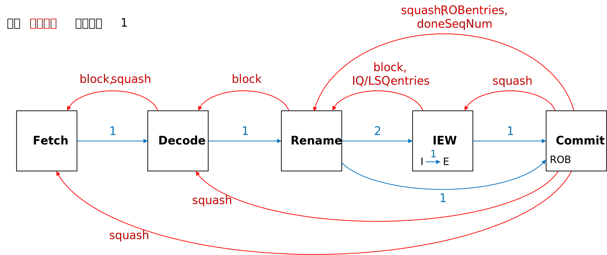
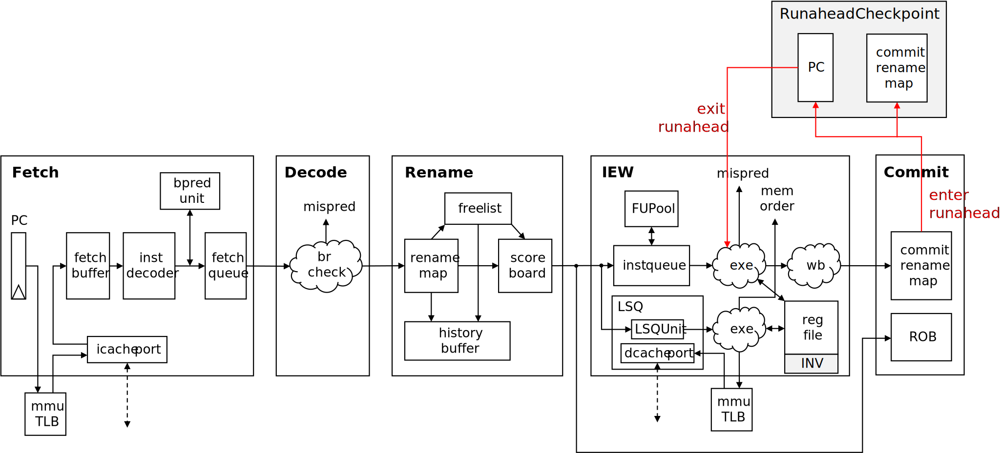
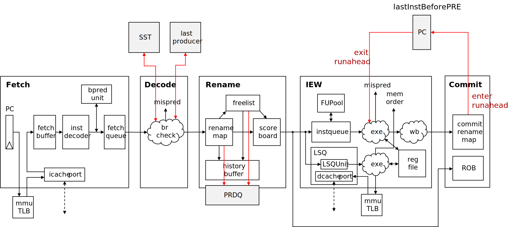

# gem5 O3CPU代码解读
本文档基于gem5 v22.0.0.1版本

## O3CPU
### 结构

### 信号与延迟

## 各阶段tick()介绍
tick()是O3CPU所有时序模块的逻辑的实现函数，每周期tick()会被调用一次

### 大致流程
* 把上个阶段的指令读到自己的buffer中
* 检查从后面来的squash信号和stall信号，并执行相应操作
* 执行本阶段固有的操作
* 若自己产生了squash或stall，则传播这个信号

### Fetch
* 使用checkSignalsAndUpdate()检查信号
  * 来自Decode的block/unblock信号
  * 来自Commit的squash信号：清空fetchQueue，重定向pc，回退branchPred
  * 来自Commit的doneSeqNum信号：更新branchPred
* 根据优先级策略选择numFetchingThreads个线程（一般SMT每周期可fetch的线程数少于总线程数），执行fetch()
  * 若fetchStatus为Running且当前block已失效，执行fetchCacheLine()，**返回**
    * 设置fetchStatus为ItlbWait，构造FetchTranslation事件，调用mmu的translateTiming()：各ISA自行实现
    * FetchTranslation完成后调用finishTranslation()：向icachePort发起sendTimingReq()，更新fetchStatus为IcacheWaitResponse
    * 内容返回后调用icachePort的recvTimingResp()，调用Fetch的processCacheCompletion()：将数据复制到fetchBuffer，更新fetchStatus为IcacheAccessComplete
  * 若fetchStatus为IcacheAccessComplete，更新为Running
  * 若fetchStatus为其他，不做任何事，**返回**
  * 当fetchWidth充足且未遇到预测跳转的branch
    * 从fetchBuffer中复制一条指令大小的内容（取决于ISA）到InstDecoder上
    * InstDecoder译码出一条staticInst，然后翻译成（多条）microop，每条microop应用buildInst()：得到一条instruction，推入fetchQueue
    * 使用lookupAndUpdateNextPC()预测branch，更新next_pc（无论是否branch都更新）
  * 设置issuePipelinedIfetch：如果经过预译码发现当前的this_pc已经越过了fetch buffer block，就取下一行（如果走到这里，说明是Running状态，可以取一行）
* 若上述步骤发生了status_change，调用updateFetchStatus()
* 对于所有线程，若issuePipelinedIfetch被设置，则调用pipelineIcacheAccesses()：取this_pc+fetchOffset所在的行
* 将指令从fetchQueue移到toDecode

### Decode
* sortInsts()：把fromFetch中的指令移到insts queue
* 对于每个active thread
  * checkSignalsAndUpdate()
    * readStallSignals()：来自Rename的block/unblock信号
    * 来自Commit的squash信号：清空fromFetch、insts queue、skidBuffer
    * 若被Rename block，调用block()：将指令从insts queue移入skidBuffer，给toFetch设置block
    * 解除Blocked或Squashing状态
  * decode()
    * 若decodeStatus为Running、Idle、Unblocking，调用decodeInsts()
      * 根据decodeStatus是否为Unblocking，从insts queue或skidBuffer读入指令
      * 对于至多decodeWidth条指令
        * 将指令移动到toRename
        * 若这条指令是branch且目标地址预测错误，则squash()
      * 如果本周期没有处理完insts queue或skidBuffer（取决于decodeStatus），则block()
    * 若decodeStatus为Unblocking，将指令从insts queue移入skidBuffer（因为Unblocking没有阻塞Fetch，如果不移下周期insts queue会被覆盖；事实上Unblocking是Decode很常见的状态，Unblocking也是在正常运行）
* 若上述步骤发生了status_change，调用status_change()

### Rename
* sortInsts()：把fromDecode中的指令移到insts queue
* 对于每个active thread
  * checkSignalsAndUpdate()
    * readFreeEntries()：从fromIEW读free IQ/SQ/LQ entry数，从fromCommit读free ROB entry数
    * readStallSignals()：从fromIEW读block/unblock信号
    * 从fromCommit读squash信号，若有则squash()
      * doSquashing()：从historyBuffer中恢复renameMap和freeList（Rename的回滚是立即完成，但是ROB是多周期，所以还是多周期的）
    * checkStall()：检查IEW的block信号、各种entry、空闲寄存器的数量，若不足则block()
    * 根据renameStatus是Blocked、Squashing、SerializeStall变换renameStatus FSM的状态
  * rename()
    * 根据renameStatus设置toDecode的block
    * 若renameStatus为Running、Idle、Unblocking，调用renameInsts()
      * 用calcFreeROBEntries()和calcFreeIQEntries()重新计算一次ROB和IQ的free entry数，min_free_entries取ROB和IQ的free entry中最小的
      * 若min_free_entries为0，则block()
      * 对于renameWidth条指令（还受ROB、IQ、LQ、SQ、renameMap的free entry数限制）
        * renameSrcRegs()：用renameMap映射源寄存器，同时从scoreboard读ready状态
        * renameDestRegs()：用renameMap映射目的寄存器，从freeList分配新寄存器，更新renameMap，清除scoreboard状态，将dest信息推入historyBuffer
        * 将指令放入toIEW中
      * 若此时还有指令没有rename完，则block()
* 若上述步骤发生了status_change，调用status_change()
* 对于每个active thread
  * 从fromCommit读doneSeqNum
  * removeFromHistory()：将historyBuffer中直到doneSeqNum的指令移除，将旧的dest寄存器归还freeList

### IEW
* ldstQueue.tick()：调用IEW的cacheUnblocked()
* sortInsts()：将fromRename的指令放入insts queue
* fuPool->processFreeUnits()：将unitsToBeFreed中的功能单元弹出，取消其busy状态
* 对于每个active thread
  * checkSignalsAndUpdate()
    * 检查fromCommit的squash信号，若有则squash()
      * instQueue.squash()：清除IQ
      * ldstQueue.squash()：清除LSQ
      * 清空skidBuffer
      * emptyRenameInsts()：清空insts queue
  * dispatch()
    * 若dispatchStatus为Running、Idle、Unblocking，调用dispatchInsts()
      * 对于至多dispatchWidth条指令
        * 若指令被标记为squashed，跳过这条指令
        * 检查IQ、LQ、SQ（若需要），若满则block()
        * 将指令插入到ldstQueue（若需要）
        * 将指令插入到instQueue
      * 若还有指令没有dispatch，block()：设置toRename的block
* executeInsts()
  * 对于fromIssue->size条指令
    * 用instQueue.getInstToExecute()从instsToExecute得到一条指令（fromIssue只记指令数量，指令本身通过instQueue拿）
    * 若是访存指令，调用ldstQueue.executeLoad()或executeStore()
    * 若是普通指令，调用inst自己的execute()
    * instToCommit()：将指令放入iewQueue，若一周期超过wbWidth条，就放到下一周期？（这玩意没有阻塞机制，不怕溢出？）
    * 检查branch预测错误和访存顺序错误，若有则调用squashDueToBranch()或squashDueToMemOrder()
* writebackInsts()
  * 对于toCommit中的指令（writeback和execute是同一周期，所以直接用toCommit中的指令）
    * 用instQueue.wakeDependents()唤醒后续指令
    * 标记scoreboard的ready状态
* instQueue.scheduleReadyInsts()
  * 用getDeferredMemInstToExecute()、getBlockedMemInstToExecute()找到被阻塞的访存指令，然后用addReadyMemInst()调度
  * 对于readyInsts queue中至多totalWidth条指令
    * 在FUPool中查询操作对应的FU idx和op_latency
    * 若op_latency为1，直接将指令放入instsToExecute queue
    * 若op_latency不为1，用cpu->schedule()计划一个FUCompletion事件
      * 到时间后会调用processFUCompletion()：调用fuPool->freeUnitNextCycle()，将指令放入instsToExecute queue的下一周期（也就是马上就能读到，强行挤占instsToExecute queue，有溢出风险）
      * 神奇的是，指令的执行时间是由issueQueue控制的，issueQueue拖到指令执行完了再给instsToExecute queue，到FU那里立即完成；但是一旦调度就会移出readyInsts queue，所以不占IQ空间
* issueToExecQueue.advance()
  * issue到exec有1周期的延迟，需要用这个队列来实现延迟
  * 这个队列只记录发射的指令数量，不记录指令本身，真正的指令记录在instsToExecute queue中
* ldstQueue.writebackStores()
  * 使用剩余的带宽，将StoreQueue中可写回的store写回
* 对于所有active thread
  * 从fromCommit读取doneSeqNum
    * 执行ldstQueue.commitStores()、commitLoads()
    * 执行instQueue.commit()：只是把instList上已经commit的指令移除，没改别的状态，不知道有什么用？
  * 将自己的instQueue和ldstQueue的free entry数传给toRename
* updateStatus()

### Commit
* 对于所有active thread
  * 如果commitStatus为ROBSquashing
    * 若本周期完成squash，将commitStatus调回Running，
    * 否则继续调用rob->doSquash()：将至多squashWidth条指令setSquashed()
* commit()
  * 若在FS模式且发现interrupt，则propagateInterrupt()
  * 对于所有active thread
    * 检查优先squash的情况，包括Trap，TC和SquashAfter
    * 检查来自IEW的squash，包括mispredict和order violation
  * getInsts()：从fromRename获取指令，将其rob->insertInst()，最后进来的指令拥有youngestSeqNum
  * commitInsts()
    * 对于至多commitWidth条指令
      * 根据SMT策略选择一个thread，用rob->readHeadInst()获得头指令
      * 若这条指令已经被squash了，就直接rob->retireHead()
      * 否则调用自己的commitHead()
        * 检查head_inst->getFault()，若有则generateTrapEvent()
        * 否则用renameMap->setEntry()更新dest映射（Commit的renameMap是commitRenameMap，专门记录提交的状态，和Rename的renameMap不一样），然后rob->retireHead()
  * 对于所有active thread
    * 将ROB的empty状态、free entry数量、doneSeqNum传给IEW（也会传给Rename，因为共用一个TimeBuffer）
* markCompletedInsts()
  * 对fromIEW的指令设置setCanCommit()

## Runahead Execution (HPCA'03)
### Fetch
* 在转移预测后对指令setBranchPredicted()
* 在Runahead模式下对所有指令setRunaheadInst()
### Decode
* 无
### Rename
* 在renameSrcRegs()时，非Runahead模式下清除物理寄存器的INV位
### IEW
* 新增squashDueToRunaheadExit()：设置toCommit->squashAfterRunahead
### Commit
* 在commitInsts()中，在Runahead模式下或指令为Runahead时
  * 将miss的指令和store（因为没有实现Runahead Cache）设置为INV
  * 将INV指令的dest寄存器设置为INV，INV指令可以直接提交
### PhysRegId
* 新增INV位（不是在RegFile里改，而是在PhysRegId里改，奇怪）
### CPU
* 增加RunaheadCheckpoint，记录入点的PC和renameMap
* 增加enterRunaheadMode()
  * 对导致Runahead的指令setTriggeredRunahead()
  * 保存当前的commitRenameMap（它增加了一个复制构造函数，会把regFile一起复制了）
  * 调用rob.markAllRunahead()
* 增加exitRunaheadMode()
  * 调用iew.squashDueToRunaheadExit()
    * 不直接恢复，而是先在IEW阶段触发一个异常，借用异常处理机制退出
    * 好像忘记恢复寄存器堆了？
### 结构

## PRE (HPCA'20)
### Fetch
* 无
### Decode
* 若为Runahead模式
  * 查找已在SST中指令的reg_to_last_producer，将其加入SST
  * 不在SST中的指令会被过滤掉
### Rename
* 增加PRDQ，记录Runahead模式下指令的dest的旧映射
* 在renameDestRegs时，记录reg_to_last_producer；若为Runahead模式，将指令加入PRDQ
### IEW
* 增加squashDueToRunaheadExit()：设置toCommit->squashAfterPRE
### Commit
* 当ROB满且头部指令在L2中miss时，enterPreMode()
### CPU
* 增加SST：记录在Load Slice中的指令的地址
* 增加reg_to_last_producer：记录每个体系结构寄存器的来源指令地址
* 增加enterPreMode()：记录lastInstBeforePRE（进入Runahead时ROB中的最后一条指令），将stalling load放入SST
* 增加exitPreMode()：向IEW发squashDueToRunaheadExit()，清空PRDQ
* 不用保存renameMap?
### 结构

